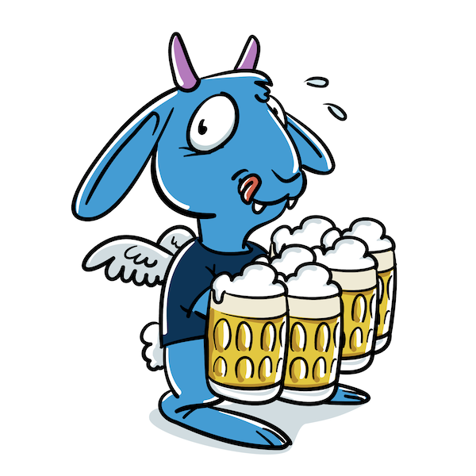

[](https://github.com/foomo/ownbrew/actions/workflows/test.yml)
[](https://goreportcard.com/report/github.com/foomo/ownbrew)
[](https://godoc.org/github.com/foomo/ownbrew)
[](https://github.com/foomo/ownbrew/actions)

<p align="center">
  
</p>

# Ownbrew

> Your local project package manager

## Installing

Install the latest release of the cli:

````bash
$ brew update
$ brew install foomo/tap/ownbrew
````

## Configuration `.ownbrew.yaml`

```yaml
# yaml-language-server: $schema=https://raw.githubusercontent.com/foomo/ownbrew/v0.2.0/ownbrew.schema.json
version: '1.1'

binDir: "bin"
tapDir: ".ownbrew/tap"
tempDir: ".ownbrew/tmp"
cellarDir: ".ownbrew/bin"
packages:
  ## https://github.com/golangci/golangci-lint/releases
  - name: golangci-lint
    tags: [ci]
    tap: foomo/tap/golangci/golangci-lint
    version: 1.61.0
  ## https://github.com/go-courier/husky/releases
  - name: husky
    tap: foomo/tap/go-courier/husky
    version: 1.8.1
```

Add the configured `binDir` folder to your `$PATH`

```shell
$ export PATH=bin:$PATH
```

## Usage

```shell
$ ownbrew help
Your local project package manager

Usage:
  ownbrew [command]

Available Commands:
  completion  Generate the autocompletion script for the specified shell
  config      Print config
  help        Help about any command
  init        Init ownbrew
  install     Install dependencies
  version     Print version

Flags:
  -c, --config string   config file (default is .ownbrew.yaml) (default ".ownbrew.yaml")
  -h, --help            help for ownbrew
  -v, --verbose         output debug information

Use "ownbrew [command] --help" for more information about a command.
```

## How to Contribute

Make a pull request...

## License

Distributed under MIT License, please see license file within the code for more details.

---
♥️ [foomo](https://www.foomo.org) by [bestbytes](https://www.bestbytes.com)
